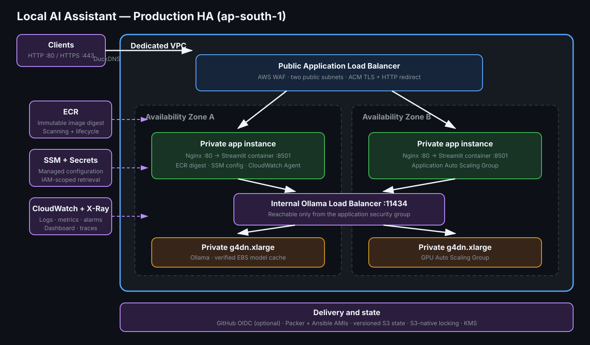

# Local AI Assistant with Ollama

A Streamlit chat application that runs against a local Ollama server. It
supports streamed replies, model selection, temperature control, bounded
session history, Docker packaging, and a two-service AWS deployment. Streamlit
runs on a small public T-family instance while Ollama runs on a private
`g4dn.xlarge` GPU instance.



See [the architecture guide](docs/architecture.md) for runtime and security
details.

## Features

- Local LLM inference through Ollama
- Streaming Streamlit chat interface
- Configurable model, endpoint, timeout, temperature, and history window
- User-friendly Ollama connection errors
- Native and Docker startup scripts
- Ansible-managed native or Docker server configuration
- Automated tests, linting, shell checks, Ansible and Terraform validation,
  and Docker build checks in GitHub Actions
- Terraform-managed Streamlit and Ollama EC2 microservices in a new VPC
- Security-group-only access from Streamlit to the private Ollama API
- Session Manager access by default, with optional restricted SSH

## Repository structure

```text
.
├── app.py
├── config.py
├── ollama_client.py
├── requirements.txt
├── requirements-dev.txt
├── pyproject.toml
├── Dockerfile
├── server_script.sh
├── docker_setup.sh
├── deploy_with_ansible.sh
├── ansible/
│   ├── ansible.cfg
│   ├── inventory.ini.example
│   ├── playbook.yml
│   ├── group_vars/
│   │   └── all.yml
│   ├── roles/
│   │   └── local_ai_assistant/
│   └── README.md
├── examples/
│   └── chat_cli.py
├── tests/
│   ├── test_config.py
│   └── test_ollama_client.py
├── docs/
│   ├── architecture.md
│   └── architecture.svg
├── terraform/
│   ├── main.tf
│   ├── variables.tf
│   ├── outputs.tf
│   ├── versions.tf
│   ├── app_user_data.sh.tftpl
│   ├── ollama_user_data.sh.tftpl
│   ├── wait_for_application.sh
│   ├── backend.tf.example
│   ├── terraform.tfvars.example
│   └── README.md
└── .github/workflows/ci.yml
```

## Quick start

Install [Ollama](https://ollama.com), then run:

```bash
git clone https://github.com/fredritchie/local-ai-assistant-ollama.git
cd local-ai-assistant-ollama
./server_script.sh
```

The script installs Python when needed, creates `.venv`, installs Python
dependencies, installs and starts Ollama when needed, pulls the default model,
and starts Streamlit. Git clone or pull is intentionally left to the operator.

Open `http://localhost:8501`.

To run each step manually:

```bash
python3 -m venv .venv
source .venv/bin/activate
python -m pip install -r requirements.txt
ollama serve
ollama pull llama3.2:3b
streamlit run app.py
```

Run `ollama serve` in a separate terminal if it is not already running as a
service.

## Configuration

Export settings before starting the app:

| Variable | Default | Description |
|---|---:|---|
| `OLLAMA_BASE_URL` | `http://localhost:11434` | Ollama API endpoint |
| `DEFAULT_MODEL` | `llama3.2:3b` | Initially selected model |
| `DEFAULT_TEMPERATURE` | `0.7` | Initial sampling temperature |
| `REQUEST_TIMEOUT_SECONDS` | `120` | Ollama request timeout |
| `MAX_HISTORY_MESSAGES` | `20` | Most recent messages sent per request |
| `OLLAMA_VERSION` | `0.32.0` | Linux installer version used by scripts |

Example:

```bash
export DEFAULT_MODEL=qwen3:4b
export MAX_HISTORY_MESSAGES=20
./server_script.sh
```

Conversation messages remain in Streamlit session state for the browser
session, but only the configured recent window is sent to Ollama.

## Docker

The setup script installs Docker and Ollama when needed, pulls the default
model, builds the image, and runs it:

```bash
./docker_setup.sh
```

Or build and run manually on Linux:

```bash
docker build -t local-ai-assistant .
docker run --rm --network host \
  -e OLLAMA_BASE_URL=http://localhost:11434 \
  -e DEFAULT_MODEL=llama3.2:3b \
  local-ai-assistant
```

On Docker Desktop:

```bash
docker run --rm -p 8501:8501 \
  -e OLLAMA_BASE_URL=http://host.docker.internal:11434 \
  local-ai-assistant
```

The image runs as a non-root user and includes a Streamlit health check.

## Server configuration with Ansible

The Ansible playbook configures two Debian-family hosts: private Ollama first,
then public Streamlit. For AWS, the wrapper reaches the private GPU host through
the Streamlit host as an SSH bastion.

```bash
python -m pip install -r requirements-dev.txt
cd ansible
cp inventory.ini.example inventory.ini
# Edit both hosts, the bastion address, SSH user, and key.
ansible-playbook playbook.yml
```

Configuration defaults are in `ansible/group_vars/all.yml`. The generated
inventory is ignored by Git. See the [Ansible guide](ansible/README.md).

### Launch and configure AWS with one command

Create `terraform/terraform.tfvars` and restrict both application and SSH
access to your public address:

```hcl
allowed_app_cidr = "203.0.113.10/32"
allowed_ssh_cidr = "203.0.113.10/32"
```

Then run from the repository root:

```bash
./deploy_with_ansible.sh
```

This one command initializes and applies Terraform, generates an ignored
Ansible inventory from Terraform outputs, records both SSH host keys, uses the
public instance as a bastion, and configures both services. Terraform shows its
normal approval prompt before creating the billable instances and NAT gateway.
For deliberate unattended deployment:

```bash
./deploy_with_ansible.sh -auto-approve
```

## AWS deployment

The Terraform stack creates a public `t3.small` Streamlit instance and a
private `g4dn.xlarge` Ollama instance in `ap-south-1`. `t3`, `t3a`, and ARM64
`t4g` application sizes are configurable. The private subnet uses a NAT gateway
for package and model downloads.

```bash
cd terraform
cp terraform.tfvars.example terraform.tfvars
# Set allowed_app_cidr to your public IPv4 address with /32.
terraform init
terraform plan -out=tfplan
terraform apply tfplan
./wait_for_application.sh
```

The application can run natively or as a Docker container:

```hcl
deployment_mode = "docker"
```

For all variables, optional SSH, remote state, bootstrap monitoring, and
destroy behavior, read the [Terraform guide](terraform/README.md).

## Development

```bash
python3 -m venv .venv
source .venv/bin/activate
python -m pip install -r requirements-dev.txt
ruff check .
pytest -v
(cd ansible && \
  ansible-playbook -i inventory.ini.example playbook.yml --syntax-check)
```

The tests mock Ollama and do not require a running model server. A minimal CLI
example is available at `examples/chat_cli.py`.

## Troubleshooting

Check Ollama:

```bash
ollama list
curl http://localhost:11434/api/tags
```

If no model is present:

```bash
ollama pull llama3.2:3b
```

On the public Streamlit instance:

```bash
sudo tail -f /var/log/cloud-init-output.log
sudo systemctl status local-ai-assistant
sudo journalctl -u local-ai-assistant -f
```

On the private Ollama instance, reached through Session Manager:

```bash
ollama list
sudo local-ollama-health
sudo systemctl status ollama
sudo journalctl -u ollama -f
```

If Terraform reports insufficient capacity or quota, request a
`g4dn.xlarge` On-Demand quota increase or retry an Availability Zone where the
instance type is offered.

## Security and limitations

- Chat history is session-only and is not multi-user isolated.
- There is no built-in authentication or TLS.
- Never expose Ollama port `11434` publicly.
- Restrict AWS port `8501` to trusted CIDRs or place an authenticated TLS proxy
  in front of the application.
- Do not commit Terraform state, variable files, plan files, or generated keys.
- Optional SSH keys are stored in Terraform state; Session Manager avoids this.

## License

No open-source license has been selected. Until a license file is added, the
repository is not licensed for redistribution or modification by others.
