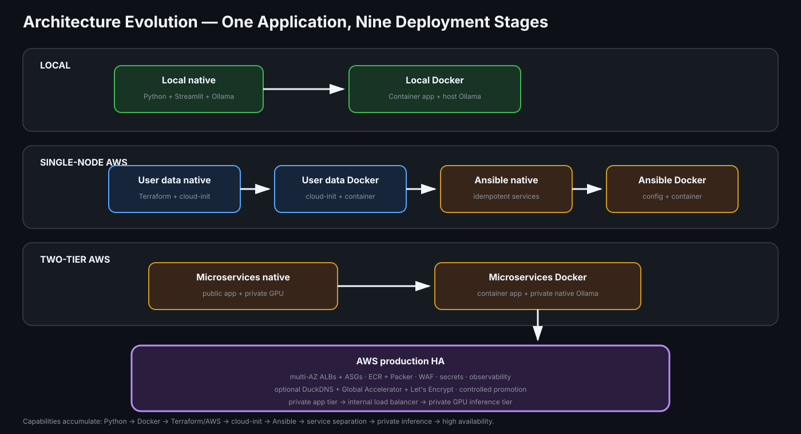

# Local AI Assistant with Ollama

This repository demonstrates how one application
can evolve from a simple local prototype into an automated, secure, and
separated AWS deployment. The application is a Streamlit chat interface backed
by locally hosted Ollama models.

Instead of combining every deployment method in one codebase, each stage is
maintained in a dedicated Git branch. This makes the progression easy to
compare across local native execution, containers, AWS automation,
configuration management, separated web and inference workloads, and the final
production-style highly available platform.

The `main` branch is intentionally documentation-only and acts as the landing
page for the portfolio. Runnable code and branch-specific instructions live in
the implementation branches linked below.

## What this project demonstrates

- Python application development with Streamlit and Ollama
- Native and Docker-based application packaging
- Infrastructure as code with Terraform
- Repeatable server configuration with Ansible
- EC2 bootstrapping through user data and cloud-init
- NVIDIA GPU inference on `g4dn.xlarge`
- Public and private subnet design in a dedicated AWS VPC
- Security groups, encrypted EBS volumes, IMDSv2, and Session Manager
- Automated health checks, bootstrap status reporting, and failure diagnostics
- Independent web and inference services with appropriate EC2 sizing
- Multi-AZ load balancing, Auto Scaling, and explicit failure domains
- Immutable ECR image promotion and Packer-built AMIs
- SSM/Secrets Manager configuration, encrypted remote Terraform state, and WAF
- CloudWatch logs, metrics, dashboards, alarms, traces, and GPU telemetry
- Controlled optional CI/CD with GitHub OIDC and protected environments
- CI checks for Python, shell scripts, Terraform, Ansible, Docker, and docs

## Deployment progression

The table is ordered from the most advanced implementation to the simplest
foundation. Each row states what it adds over the branch immediately below it.

| Branch | Description | Advantage over the previous branch |
|---|---|---|
| [AWS production HA](https://github.com/fredritchie/local-ai-assistant-ollama/tree/feature/aws-production-ha) | The final portfolio branch adds a multi-AZ public ALB, private app and GPU Auto Scaling Groups, an internal Ollama ALB, Nginx on port 80, ECR delivery, Packer AMIs, managed configuration, remote state, WAF, observability, tests, and optional controlled CI/CD. | Turns the separated Docker architecture into a highly available, immutable, observable, and promotion-driven platform with documented security, recovery, model lifecycle, and cost controls. |
| [AWS EC2 Ansible microservices Docker](https://github.com/fredritchie/local-ai-assistant-ollama/tree/feature/aws-ec2-ansible-microservices-docker) | Terraform creates separate public Streamlit and private GPU Ollama instances. Ansible manages Ollama natively and Streamlit as a Docker container. | Adds container isolation and reproducible image-based delivery to the separated architecture. |
| [AWS EC2 Ansible microservices native](https://github.com/fredritchie/local-ai-assistant-ollama/tree/feature/aws-ec2-ansible-microservices-native) | Terraform creates separate instances, while Ansible installs native Streamlit publicly and Ollama privately. | Isolates inference from the internet and allows the application and GPU tiers to be sized independently. |
| [AWS EC2 Ansible Docker](https://github.com/fredritchie/local-ai-assistant-ollama/tree/feature/aws-ec2-ansible-docker) | Terraform provisions one public GPU instance. Ansible manages native Ollama and Dockerized Streamlit on that instance. | Adds reproducible container packaging and runtime isolation. |
| [AWS EC2 Ansible native](https://github.com/fredritchie/local-ai-assistant-ollama/tree/feature/aws-ec2-ansible-native) | Terraform provisions one public GPU instance, and Ansible manages native Ollama and Streamlit services. | Adds repeatable, idempotent configuration and in-place application updates. |
| [AWS EC2 user data Docker](https://github.com/fredritchie/local-ai-assistant-ollama/tree/feature/aws-ec2-userdata-docker) | Terraform provisions one public GPU instance. EC2 user data installs native Ollama and launches Streamlit with Docker. | Adds container packaging to the automated AWS deployment. |
| [AWS EC2 user data native](https://github.com/fredritchie/local-ai-assistant-ollama/tree/feature/aws-ec2-userdata-native) | Terraform provisions a public `g4dn.xlarge`, and EC2 user data installs native Ollama and Streamlit. | Introduces repeatable AWS infrastructure, GPU inference, encrypted storage, and remote management. |
| [Local Docker](https://github.com/fredritchie/local-ai-assistant-ollama/tree/feature/local-docker) | Ollama runs on the local host while Streamlit runs in a Docker container. | Adds an isolated and reproducible application runtime. |
| [Local native](https://github.com/fredritchie/local-ai-assistant-ollama/tree/feature/local-native) | Python, Streamlit, and Ollama run directly on one local machine. | Establishes the simplest, lowest-cost foundation for development. |

## Repository approach

Every implementation branch is self-contained and includes only the files
needed for that deployment method. Depending on the branch, this includes:

- Application source code and automated tests
- Dependency and environment configuration
- Native startup scripts or a Dockerfile
- Terraform configurations and example variables
- EC2 bootstrap scripts with completion markers and failure reporting
- Ansible inventories, roles, handlers, and deployment helpers
- Architecture documentation and CI workflows

The final production branch additionally includes environment-separated remote
state, immutable artifacts, edge protection, autoscaling, observability,
integration/infra tests, operational runbooks, and a documented cost model.

This branch-per-stage structure keeps the learning path visible in Git history
and prevents local, user-data, Ansible, native, Docker, and microservice
concerns from becoming mixed together.

## Engineering decisions highlighted

- **Separation of concerns:** later branches place Streamlit and Ollama on
  different instances and network tiers.
- **Least exposure:** the microservice branches keep Ollama on a private subnet
  and allow its API traffic only from the Streamlit security group.
- **Reproducibility:** Terraform, cloud-init, Docker, and Ansible each provide a
  progressively stronger deployment workflow.
- **Operational visibility:** bootstrap markers, cloud-init failure reporting,
  service health checks, and a wait helper make deployment status observable.
- **Safe access:** AWS branches support Session Manager and optional
  CIDR-restricted SSH instead of requiring unrestricted administrative ports.
- **Cost awareness:** the branches make the tradeoffs between local execution,
  a single EC2 instance, separated workloads, and production HA explicit.
- **Production progression:** the final branch adds failure-domain-aware
  capacity, ALBs, ECR digest promotion, secure runtime configuration, remote
  state locking, WAF, telemetry, and controlled deployment approvals.

## Technology stack

| Area | Technologies |
|---|---|
| Application | Python, Streamlit, Ollama |
| Containers | Docker |
| Infrastructure | Terraform, AWS EC2, VPC, ALB, Auto Scaling, EBS, ECR, IAM, Systems Manager, Secrets Manager, WAF |
| Configuration | EC2 user data, cloud-init, Ansible, Packer, systemd |
| Observability | CloudWatch Logs, metrics, dashboards and alarms; X-Ray-compatible OTLP traces |
| Quality | Pytest, Ruff, ShellCheck, TFLint, Checkov, Trivy, Terraform native tests, Ansible lint, GitHub Actions |

## Explore the project

Select a branch from the deployment table to review its source code, README,
prerequisites, configuration options, validation commands, and deployment
workflow. Each branch is self-contained and can be reviewed independently as an
example of its deployment approach.

AWS branches create billable resources in `ap-south-1`. Review the selected
branch's Terraform plan before applying it and destroy unused environments.
