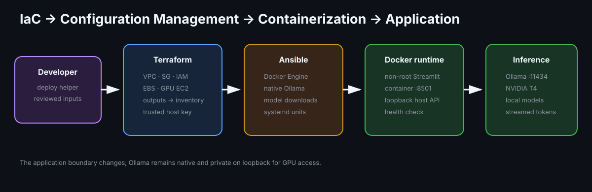

# Architecture

Terraform creates one public GPU EC2 instance. Ansible installs native Ollama
and Streamlit systemd services on that host. Streamlit calls Ollama over
`127.0.0.1:11434`; Ollama is not exposed by the security group.

## Provisioning and configuration ownership

Terraform owns AWS infrastructure state. `deploy_with_ansible.sh` turns
Terraform outputs into a restricted inventory and known-host entry, then
Ansible owns package, model, repository, Python environment, systemd, and
health-check configuration on the GPU host.

Streamlit port `8501` and SSH port `22` are restricted to configured CIDRs.
The instance uses encrypted gp3 storage, IMDSv2, and Session Manager.
