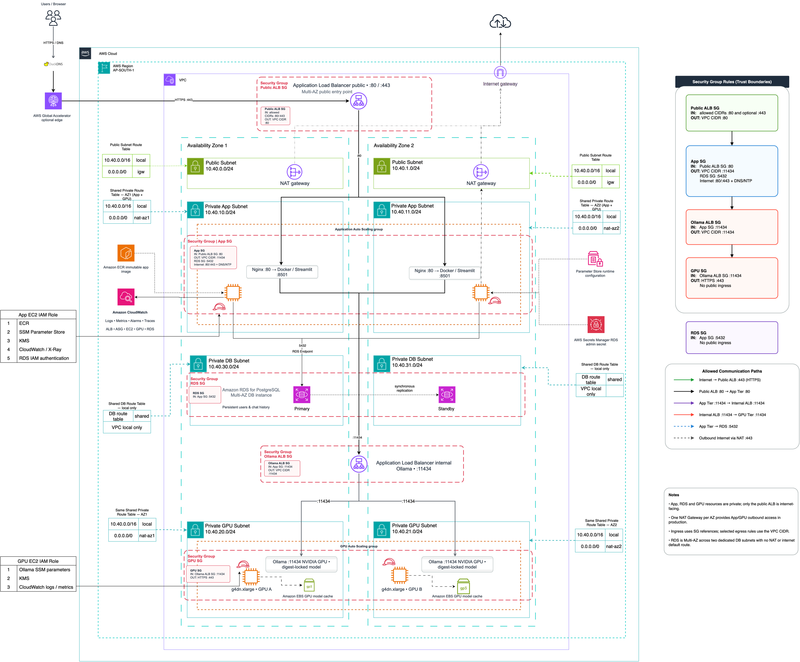
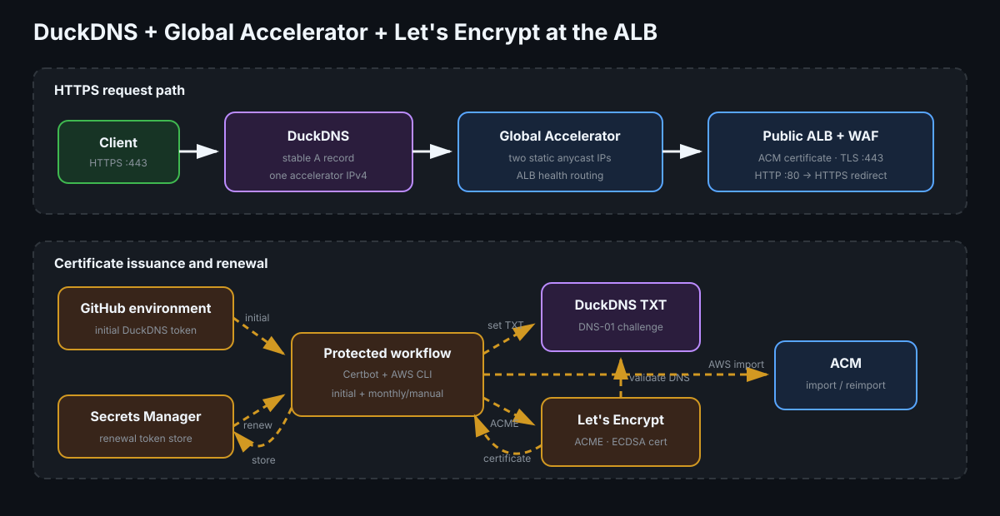

# Production architecture and failure domains

This guide defines the production request paths, network and availability-zone
boundaries, failure behavior, scaling limits, and independently versioned
artifacts.

> **Documentation:** [Index](README.md)
> · [All architecture diagrams](diagrams/README.md)
> · [Deployment guide](deployment-guide.md)

## Architecture context

### Production AWS topology



## Request path



```text
Client
  → optional DuckDNS and Global Accelerator
  → public ALB on 80 or 443
  → private app ASG target on Nginx port 80
  → Streamlit container on localhost port 8501
      ├─→ internal Ollama ALB on port 11434
      │    → private g4dn.xlarge Ollama target
      └─→ private PostgreSQL RDS (users and chat history)

Controlled deployment
  → VPC-scoped CodeBuild database-bootstrap job
  → PostgreSQL RDS (creates/grants the IAM database user)
```

The public ALB, both Auto Scaling Groups, and the RDS DB subnet group span two
Availability Zones. RDS uses dedicated private database subnets whose route
table has no NAT or internet default route. Application and GPU instances have
no public IP addresses. Only the public ALB accepts internet traffic.
Security-group references restrict the internal service and database hops.

The database-bootstrap job is not on the request path. It runs after a
successful infrastructure deployment, uses a dedicated security group and
service role, and is the only workload component that reads the RDS managed
administrator secret.

## Availability behavior

- The public ALB removes an unhealthy Nginx/Streamlit target.
- The app ASG replaces it and maintains the configured minimum capacity.
- The internal ALB removes an unhealthy Ollama target.
- The GPU ASG replaces the target and verifies every model digest before the
  target becomes reachable.
- Production uses one NAT Gateway per AZ so an AZ failure does not remove all
  private outbound access.
- Rolling instance refreshes keep healthy capacity while promoting an AMI,
  image digest, bootstrap change, or model-cache snapshot.

ALBs fail open when every registered target is unhealthy. Alarms therefore
monitor unhealthy target count and the runbook treats an all-target failure as
urgent. See the [AWS target health behavior](https://docs.aws.amazon.com/elasticloadbalancing/latest/application/target-group-health-checks.html).

## Session behavior

Streamlit session state is process-local, so load-balancer movement can reset
the active browser view. Users, conversations, and messages are written to a
private encrypted PostgreSQL RDS instance after every message. On sign-in, the
sidebar lists the user's prior conversations, allowing recovery after a browser
or application-instance restart. RDS is multi-AZ in production and retains
automated backups for the configured retention period.

## Environment differences

| Setting | Development | Production |
|---|---:|---:|
| App capacity | 1 desired, 2 maximum | 2 desired, 4 maximum |
| GPU capacity | 1 | 2 |
| NAT Gateways | 1 | 2 |
| Log retention | 7 days | 30 days |
| Public transport | HTTP by default; HTTPS when configured | HTTPS when ACM certificate is configured; otherwise HTTP |
| Optional public name | DuckDNS + Global Accelerator when enabled | DuckDNS + Global Accelerator when enabled |
| AWS WAF | Off | Rate limit and managed rules |
| ALB deletion protection | Off | On |
| State key | `dev/terraform.tfstate` | `prod/terraform.tfstate` |

Development preserves the topology but is not highly available. It exists for
integration tests and portfolio demonstrations at a lower cost.

## Scaling boundaries

The app ASG scales on average CPU utilization. GPU scaling is deliberately
capacity-controlled because a new node must mount or populate its model cache,
verify digests, and warm a model before serving traffic. Increase GPU capacity
through a reviewed deployment after checking EC2 quotas and AZ availability.

## Immutable artifacts

- Packer produces versioned app and GPU AMIs with Ansible.
- CI or the manual build script produces a multi-architecture ECR image.
- Terraform consumes the ECR image by digest.
- The model cache can be restored from an approved EBS snapshot.
- A model manifest pins the name, digest, disk estimate, VRAM estimate, and
  preload decision.

This permits independent rollback of host image, application image, and model
cache.

## Implementation references

- Terraform source: [`network.tf`](../terraform/modules/platform/network.tf),
  [`compute.tf`](../terraform/modules/platform/compute.tf),
  [`database.tf`](../terraform/modules/platform/database.tf), and
  [`load_balancing.tf`](../terraform/modules/platform/load_balancing.tf)
