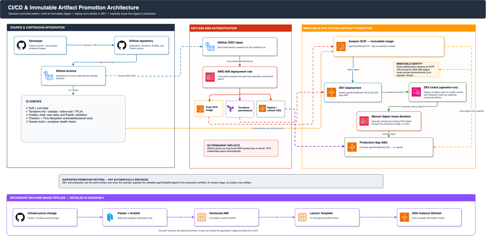

# End-to-end deployment guide

This guide deploys the application through GitHub Actions. It uses committed,
non-secret configuration files for environment-specific values and a GitHub
environment secret only for the DuckDNS token.

> **Documentation:** [Index](README.md)
> · [All architecture diagrams](diagrams/README.md)
> · [Operations guide](operations.md)

## Architecture context

### Controlled artifact promotion



## Delivery control model

- GitHub Actions authenticates with short-lived OIDC credentials. The
  bootstrap trust policy binds the deployment role to immutable GitHub owner
  and repository IDs.
- GitHub Environments can gate jobs before Terraform planning and again before
  the dependent apply job. Configure required reviewers on every environment
  where a post-plan human approval is required; production should require them.
- `operation=plan` uploads a saved binary plan and its readable `tfplan.txt`
  rendering without changing AWS. `operation=deploy` creates the same artifacts
  and applies that saved binary plan after the apply job passes any configured
  environment protection rules.
- The first DuckDNS/Let's Encrypt deployment applies the reviewed HTTP bootstrap
  plan, then issues the certificate and reconciles the HTTPS listener in the
  protected apply job. Production teardown makes a deliberately **targeted** change only
  through AWS APIs to remove deletion protection from the database and two load
  balancers already recorded in state. It fails without creating anything when
  production state is empty. These exceptions are required before a final
  destroy plan can exist. The final infrastructure plan is still saved,
  published, and approved before its apply.
- Leaving `image_uri` empty builds the selected commit. Supplying
  `repository@sha256:...` reuses a previously tested immutable image.
- After apply, the workflow runs the VPC-scoped database-bootstrap CodeBuild
  project. A bootstrap failure fails the deployment before the new application
  is accepted as healthy.
- `operation=destroy` requires `confirm_destroy=DESTROY`. Production deletion
  protection is disabled only inside that explicitly approved workflow path.
- CI never applies or destroys production automatically on push. Environment
  concurrency permits only one infrastructure operation at a time.

## Fresh-fork operator runbook

Use this runbook when deploying a fork into a new AWS account. The example
account IDs, ECR URLs, state buckets, domains, and email addresses elsewhere
in this repository are not reusable deployment inputs.

### Preflight checklist

Before creating resources, confirm all of the following:

- Your AWS identity can create the bootstrap resources and the workload
  resources in `ap-south-1`, including IAM, S3, KMS, ECR, VPC, EC2, RDS,
  CodeBuild, CloudWatch, and SNS.
- Your GitHub identity can create environments, environment variables, and the
  `prod` environment secret. Configure required reviewers for production.
- Your account has sufficient EC2 quota and capacity for the selected GPU
  instance type in the chosen Availability Zones.
- `allowed_app_cidrs` contains your real public IP, office, or VPN CIDR. Use
  `0.0.0.0/0` only for short-lived development access; never use `0.0.0.0/32`.
- You understand that the initial application account is `admin` / `changeme`.
  Configure a bcrypt `ADMIN_PASSWORD_HASH` secret before making the application
  broadly reachable.

### 1. Fork and prepare your workstation

1. Fork this repository to your GitHub account or organization, then clone
   your fork and push to its default branch.
2. Install and authenticate the required local tools: AWS CLI, Terraform
   (version 1.10 or later), GitHub CLI, Git, and Python 3.
3. Authenticate both CLIs against the intended account and repository:

   ```bash
   aws sts get-caller-identity
   gh auth login
   gh repo view --json nameWithOwner,id,owner
   ```

   Confirm that the displayed AWS account is yours and that GitHub reports
   your fork, not the upstream repository.
4. Verify GPU quota and capacity in the deployment region. The default GPU
   instance type is `g4dn.xlarge`; select a supported alternative only after
   reviewing the module validations and model requirements.

### 2. Configure deployment inputs

Generate a real, digest-locked model manifest. The checked-in example has an
invalid placeholder digest and cannot be deployed:

```bash
python3 scripts/lock_model_manifest.py \
  --model llama3.2:3b:2.0:4.0:true \
  > models/model-manifest.json
```

Create environment input files from the examples:

```bash
cp terraform/environments/dev/terraform.tfvars.example \
  terraform/environments/dev/terraform.tfvars
cp terraform/environments/prod/terraform.tfvars.example \
  terraform/environments/prod/terraform.tfvars
```

In both files, set `model_manifest_file` to
`../../../models/model-manifest.json`. Set `allowed_app_cidrs` deliberately:

```hcl
# Recommended: your current public IP or office/VPN range.
allowed_app_cidrs = ["203.0.113.10/32"]

# Development-only alternative: permit any IPv4 client.
# allowed_app_cidrs = ["0.0.0.0/0"]
```

Do not set `allowed_app_cidrs = ["0.0.0.0/32"]`; that permits only the single
address `0.0.0.0`, so the public application will time out for all real users.

### 3. Bootstrap the AWS account and GitHub OIDC role

Choose a globally unique state-bucket name. Obtain the immutable GitHub owner
and repository IDs from the previous `gh repo view` command, then create
`terraform/bootstrap/terraform.tfvars`:

```hcl
state_bucket_name    = "YOUR_GLOBALLY_UNIQUE_STATE_BUCKET"
enable_github_oidc   = true
github_owner         = "YOUR_GITHUB_OWNER"
github_repository    = "YOUR_REPOSITORY"
github_owner_id      = "YOUR_NUMERIC_OWNER_ID"
github_repository_id = "YOUR_NUMERIC_REPOSITORY_ID"
```

Apply the bootstrap stack from an administrator-controlled terminal:

```bash
terraform -chdir=terraform/bootstrap init
terraform -chdir=terraform/bootstrap plan
terraform -chdir=terraform/bootstrap apply
```

This creates your account's ECR repository, encrypted Terraform state bucket,
KMS key, GitHub OIDC provider, and GitHub deployment role. The role trust
policy is bound to your fork's immutable GitHub IDs. Reapply this stack whenever
the deployment workflow needs additional AWS permissions.

Verify its outputs:

```bash
terraform -chdir=terraform/bootstrap output
```

### 4. Create protected GitHub environments

In your fork, open **Settings → Environments** and create `dev` and `prod`.
For `prod`, configure required reviewers. The workflow requests an OIDC token
for the selected environment, so the environment names must remain exactly
`dev` and `prod` unless you also update the Terraform bootstrap inputs.

Create the ignored operator input file and enter your fork and alert details:

```bash
cp .github/deployment-config/operator.env.example \
  .github/deployment-config/operator.env
${EDITOR:-vi} .github/deployment-config/operator.env
```

Set `GITHUB_OWNER`, `GITHUB_REPOSITORY`, and `ALARM_EMAIL`. For production,
replace the example DuckDNS label and email if you enable DuckDNS and Let's
Encrypt. This local file is ignored by Git and must never contain a password,
API key, or DuckDNS token.

Run the synchronization script to create GitHub environment configuration and
commit the generated, non-secret files:

```bash
./scripts/sync_github_environment.sh dev
./scripts/sync_github_environment.sh prod

git add models/model-manifest.json \
  terraform/environments/dev/terraform.tfvars \
  terraform/environments/prod/terraform.tfvars \
  .github/deployment-config/dev.env \
  .github/deployment-config/prod.env
git commit -m "Configure deployment environments"
git push
```

When prompted during the production synchronization, enter a newly rotated
DuckDNS token. The script sends it directly to the GitHub `prod` environment
as a secret and does not write it to disk. The generated `dev.env` and
`prod.env` files are non-secret, but they contain account-specific identifiers
and settings and therefore must be regenerated for every fork.

### 5. Deploy and verify development

In **GitHub → Actions → Controlled deployment**, run:

1. `environment=dev`, `operation=plan`; review `tfplan.txt` in the plan artifact.
2. `environment=dev`, `operation=deploy`; leave `image_uri` blank to build the
   selected commit, or provide a previously built immutable ECR
   `repository@sha256:...` reference. Review the deploy run's newly published
   `tfplan.txt`; GitHub pauses the apply job only if `dev` has required reviewers
   configured.

The deployment creates the development VPC, ALB, app and GPU Auto Scaling
groups, two dedicated database subnets, RDS, monitoring, and a VPC-scoped CodeBuild job. That CodeBuild job
creates the `localai_app` PostgreSQL user and grants `rds_iam`; the application
does not receive the RDS master password.

After the workflow succeeds:

```bash
terraform -chdir=terraform/environments/dev init \
  -backend-config="bucket=YOUR_GLOBALLY_UNIQUE_STATE_BUCKET" \
  -backend-config="kms_key_id=YOUR_STATE_KMS_KEY_ARN"
terraform -chdir=terraform/environments/dev output application_url
```

Open the returned URL. Confirm the SNS subscription email, then inspect the
following CloudWatch log groups if a deployment or login fails:

```text
/local-ai-assistant/dev/app
/local-ai-assistant/dev/bootstrap
/local-ai-assistant/dev/database-bootstrap
```

If the workflow reports a database-bootstrap failure, use an administrator or
deployment identity—not the application EC2 role—to inspect it:

```bash
aws logs tail /local-ai-assistant/dev/database-bootstrap --follow
```

After it succeeds, verify the IAM database connection from an application
instance reached through Session Manager:

```bash
docker exec local-ai-assistant python -c \
  'from database import initialize_database; initialize_database(); print("IAM database connection succeeded")'
```

If this reports password authentication failure, the IAM user has not yet been
granted `rds_iam`; rerun the controlled `dev` deployment or start the dedicated
CodeBuild project with a deployment/admin identity. Do not add RDS master-secret
or `rds:DescribeDBInstances` access to the application role.

### 6. Promote to production

Copy the successful development image's immutable `repository@sha256:...`
reference from the workflow log. Run a production `plan`, then a production
`deploy` with that digest in `image_uri`; review the deploy run's `tfplan.txt`
artifact and approve the protected `prod` apply job when GitHub requests it.
Do not promote a mutable tag such as `latest`.

With the default production operator settings, the first production deployment
creates the DuckDNS/Let's Encrypt HTTPS path. Confirm the certificate, DNS,
and health URL before declaring the deployment complete. The certificate-renewal
workflow runs monthly and can also be started manually.

### 7. Release, rollback, and teardown

For later releases, repeat only the development plan/deploy and production
promotion steps. To roll back, redeploy the prior reviewed digest through the
same workflow.

To destroy an environment, run the controlled workflow with
`operation=destroy`, `confirm_destroy=DESTROY`, and the deployed image digest.
Production retains a final RDS snapshot. The bootstrap state bucket, KMS key,
and ECR repository are deliberately not destroyed with an environment.

## Optional DuckDNS and TLS lifecycle

TLS terminates at the public ALB, so the public certificate must be imported
into ACM rather than installed on private Nginx instances. The controlled
workflow uses a DuckDNS DNS-01 challenge, imports the certificate into ACM in
`ap-south-1`, and redirects HTTP to HTTPS after the certificate is available.
No private key is stored in Terraform state or on EC2.

### Initial provisioning

Set these values in the ignored
`.github/deployment-config/operator.env` before synchronizing production:

```dotenv
PROD_ENABLE_DUCKDNS=true
PROD_ENABLE_LETSENCRYPT=true
PROD_DUCKDNS_SUBDOMAIN=your-local-ai-assistant
PROD_LETSENCRYPT_EMAIL=operator@example.com
```

Run `./scripts/sync_github_environment.sh prod` and enter the rotated DuckDNS
token when prompted. The script writes non-secret configuration to the
protected GitHub environment and sends the token directly to the
`DUCKDNS_TOKEN` environment secret. The first production deploy applies the
reviewed HTTP bootstrap plan, then creates the Global Accelerator and HTTP
path, updates DuckDNS, imports the certificate, and applies the final HTTPS
listener from the protected apply job. A `plan` run never issues a certificate.

### Renewal and expiry monitoring

The `Renew DuckDNS Let's Encrypt certificate` workflow runs monthly and can be
started manually. It retrieves the DuckDNS token from Secrets Manager,
reissues the certificate, and imports it into the existing ACM ARN. CloudWatch
raises an alarm when fewer than 30 days remain before expiry.

### Recovery

If DNS update or issuance fails, correct `operator.env`, rerun the environment
synchronization, and rerun the controlled production deployment. Do not create
a placeholder certificate ARN or manually remove workflow-managed Global
Accelerator and Parameter Store values. If renewal introduces a bad
certificate, restore the previous ACM ARN in Parameter Store and redeploy
before investigating DNS and issuance logs.

### Availability limitation

Global Accelerator supplies two stable IPv4 addresses, but DuckDNS accepts one
IPv4 address for a subdomain. This integration publishes the first anycast
address. Use Route 53 or another DNS provider with multiple A-record support
when both accelerator addresses must be published.

Protocol and service references:

- [DuckDNS update API](https://www.duckdns.org/spec.jsp)
- [Let's Encrypt DNS-01 challenge](https://letsencrypt.org/docs/challenge-types/)
- [AWS ACM imported certificates](https://docs.aws.amazon.com/acm/latest/userguide/import-certificate.html)

## Troubleshooting

| Symptom | Check |
|---|---|
| OIDC authentication fails | Verify the GitHub owner/repository values used in bootstrap and the role ARN in the environment file. |
| Pipeline cannot find configuration | Commit `.github/deployment-config/dev.env` or `prod.env`; only the `.example` files are not sufficient. |
| Database bootstrap fails | Inspect `/local-ai-assistant/<environment>/database-bootstrap`; confirm the CodeBuild project can reach RDS and read the RDS master secret. |
| First prod run fails before certificate issuance | Verify `ENABLE_DUCKDNS=true`, `ENABLE_LETSENCRYPT=true`, `DUCKDNS_SUBDOMAIN`, `LETSENCRYPT_EMAIL`, and the `DUCKDNS_TOKEN` prod secret. |
| HTTPS is unavailable | Check the deployment log, the DuckDNS record, ACM certificate status, and the certificate-expiry alarm. |
| No alert email | Confirm the SNS subscription message sent by AWS. |
| App health wait times out | Review the app and bootstrap CloudWatch log groups; initial GPU model startup can take several minutes. |

For runtime diagnostics and rollback procedures, see
[Operations and recovery](operations.md).

## Implementation references

- Delivery source: [`ci.yml`](../.github/workflows/ci.yml),
  [`deploy.yml`](../.github/workflows/deploy.yml),
  [`renew-certificate.yml`](../.github/workflows/renew-certificate.yml),
  [`build_and_push.sh`](../scripts/build_and_push.sh),
  [`deploy.sh`](../scripts/deploy.sh),
  [`terraform/environments/dev`](../terraform/environments/dev/), and
  [`terraform/environments/prod`](../terraform/environments/prod/)
- Environment and certificate automation:
  [`sync_github_environment.sh`](../scripts/sync_github_environment.sh),
  [`update_duckdns.sh`](../scripts/update_duckdns.sh), and
  [`issue_letsencrypt_duckdns.sh`](../scripts/issue_letsencrypt_duckdns.sh)
