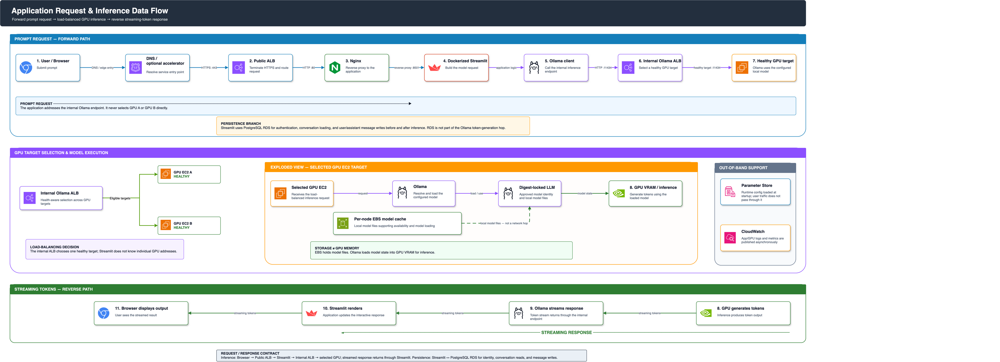
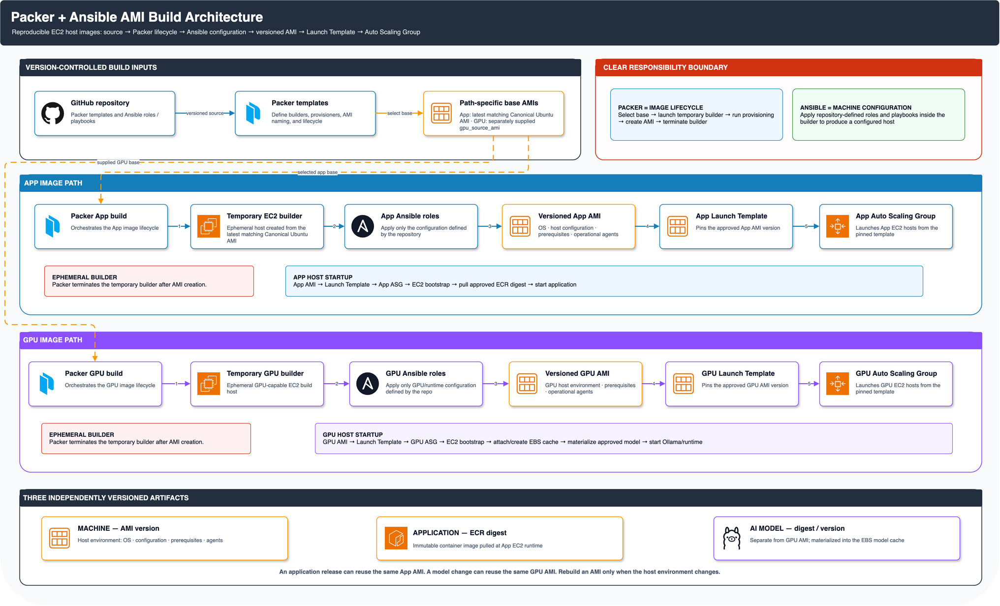
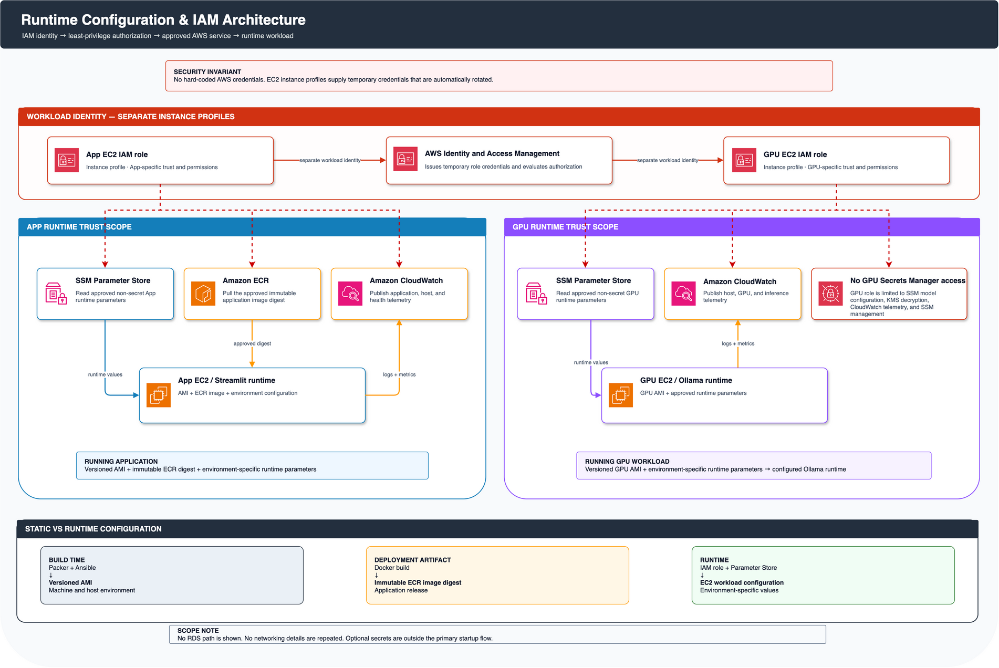
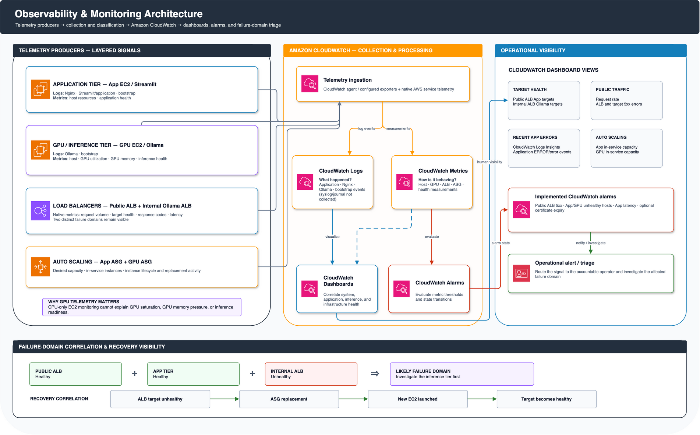
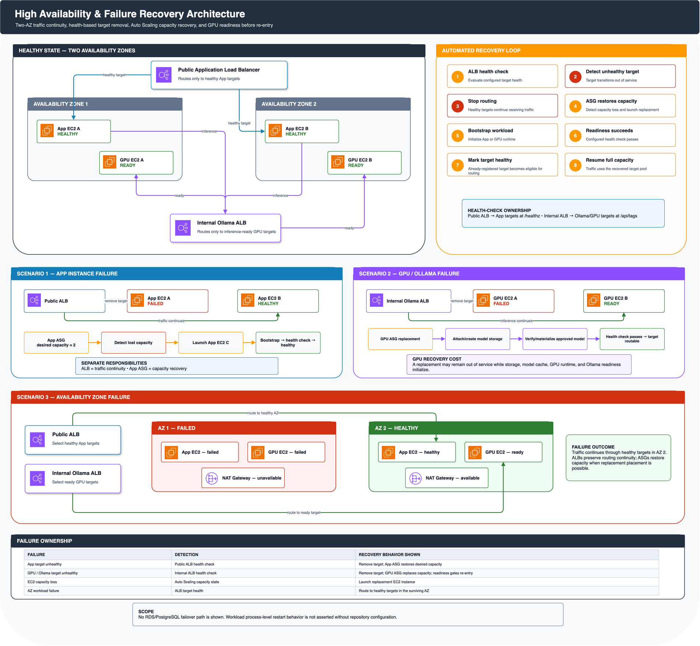
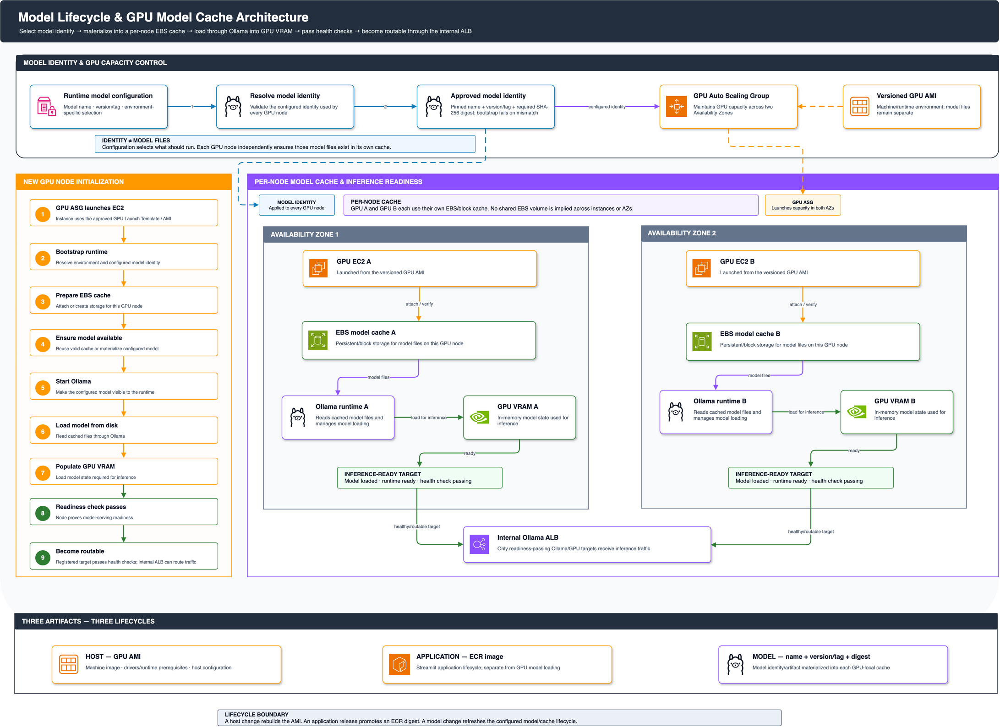
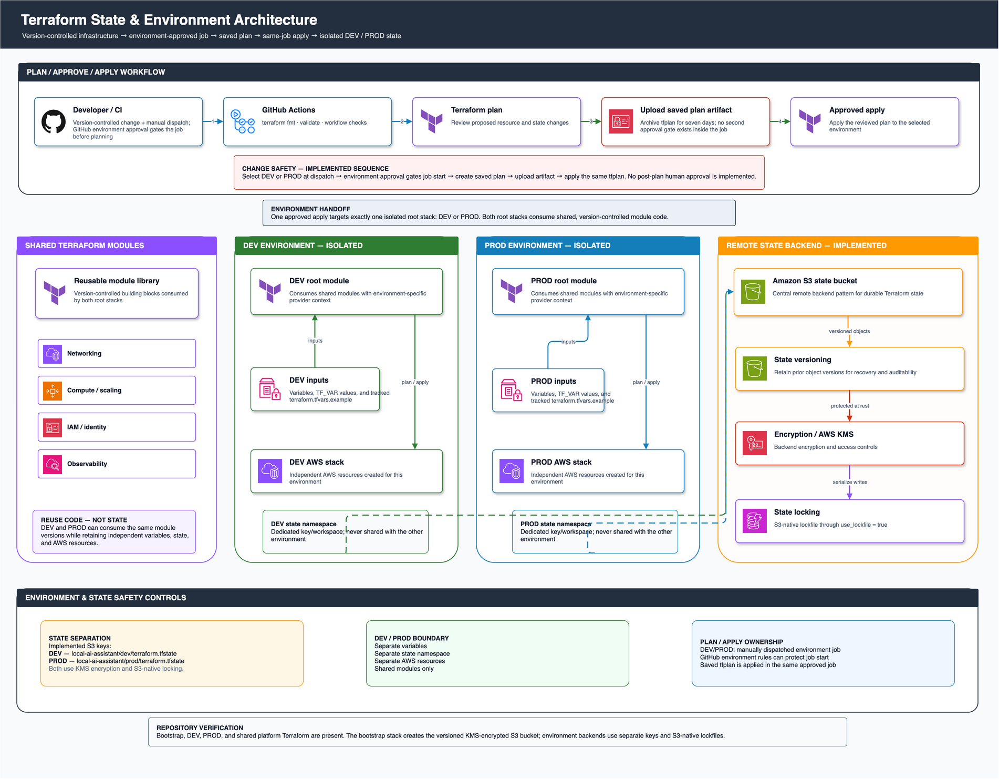

# Architecture diagram catalogue

> **Navigation:** [Return to the project README](../../README.md)
> · [Open the simplified HA overview](../architecture.svg)
> · [Open the DuckDNS/TLS flow](../domain-tls-flow.svg)

This catalogue contains every unique architecture diagram maintained for the
repository. Rendered PNG files are used by Markdown, while the editable Draw.io
sources are stored in [`source/`](source/).

The diagrams describe the current repository implementation. In particular,
RDS uses the dedicated `10.40.30.0/24` and `10.40.31.0/24` database subnets and
a shared database route table with no NAT or internet default route. The source
of truth is [`network.tf`](../../terraform/modules/platform/network.tf) and
[`database.tf`](../../terraform/modules/platform/database.tf).

## Production AWS reference architecture


- [Editable source](source/production_aws_reference_architecture.drawio)
- Implementation: [`network.tf`](../../terraform/modules/platform/network.tf),
  [`compute.tf`](../../terraform/modules/platform/compute.tf),
  [`database.tf`](../../terraform/modules/platform/database.tf), and
  [`load_balancing.tf`](../../terraform/modules/platform/load_balancing.tf)

## Application request, inference, and persistence flow



- [Editable source](source/application_request_inference_data_flow.drawio)
- Implementation: [`app.py`](../../app.py), [`database.py`](../../database.py),
  and [`ollama_client.py`](../../ollama_client.py)

## CI/CD and immutable artifact promotion


- [Editable source](source/cicd_immutable_artifact_promotion_architecture.drawio)
- Implementation: [`ci.yml`](../../.github/workflows/ci.yml),
  [`deploy.yml`](../../.github/workflows/deploy.yml), and
  [`build_and_push.sh`](../../scripts/build_and_push.sh)

## Packer and Ansible AMI builds



- [Editable source](source/packer_ansible_ami_build_architecture.drawio)
- Implementation: [`app.pkr.hcl`](../../packer/app.pkr.hcl),
  [`gpu.pkr.hcl`](../../packer/gpu.pkr.hcl), and
  [`playbook.yml`](../../ansible/playbook.yml)

## Runtime configuration and IAM



- [Editable source](source/runtime_configuration_iam_architecture.drawio)
- Implementation: [`configuration.tf`](../../terraform/modules/platform/configuration.tf),
  [`iam.tf`](../../terraform/modules/platform/iam.tf), and
  [`database_bootstrap.tf`](../../terraform/modules/platform/database_bootstrap.tf)

## Observability and monitoring



- [Editable source](source/observability_monitoring_architecture.drawio)
- Implementation: [`observability.tf`](../../terraform/modules/platform/observability.tf),
  [`logging.tf`](../../terraform/modules/platform/logging.tf), and
  [`report_instance_failures.sh`](../../scripts/report_instance_failures.sh)

## High availability and failure recovery



- [Editable source](source/high_availability_failure_recovery_architecture.drawio)
- Implementation: [`compute.tf`](../../terraform/modules/platform/compute.tf),
  [`load_balancing.tf`](../../terraform/modules/platform/load_balancing.tf), and
  [`wait_for_application.sh`](../../scripts/wait_for_application.sh)

## Model lifecycle and GPU cache



- [Editable source](source/model_lifecycle_gpu_cache_architecture.drawio)
- Implementation: [`gpu_user_data.sh.tftpl`](../../terraform/modules/platform/templates/gpu_user_data.sh.tftpl),
  [`lock_model_manifest.py`](../../scripts/lock_model_manifest.py), and
  [`model-manifest.example.json`](../../models/model-manifest.example.json)

## Terraform state and environment isolation



- [Editable source](source/terraform_state_environment_architecture.drawio)
- Implementation: [`bootstrap/`](../../terraform/bootstrap/),
  [`environments/dev/`](../../terraform/environments/dev/),
  [`environments/prod/`](../../terraform/environments/prod/), and
  [`deploy.yml`](../../.github/workflows/deploy.yml)

## Repository-native overview diagrams

- [Production HA overview](../architecture.svg)
- [DuckDNS and TLS flow](../domain-tls-flow.svg)

## Maintaining the diagrams

Draw.io `31.1.8` is the pinned renderer. After changing any editable source,
regenerate all PNG files from the repository root:

```bash
bash scripts/render_architecture_diagrams.sh
```

Before committing, verify that every source has a current, same-named render,
the source-digest manifest is current, and Markdown references and diagram XML
remain valid:

```bash
python scripts/check_documentation.py
bash scripts/render_architecture_diagrams.sh --check
```

On macOS, the rendering script detects the standard Draw.io application path.
For another installation location, set `DRAWIO_BIN` to the executable. The CI
job installs the pinned Linux package, verifies its SHA-256 digest, and renders
under Xvfb. CI test-renders every source and compares the platform-independent
[`source.sha256`](source.sha256) manifest because Draw.io PNG rasterization can
differ between operating systems even when the Draw.io version is identical.

When code and a diagram disagree, update both in the same change and treat the
Terraform, workflow, and application files linked above as the executable
source of truth.
