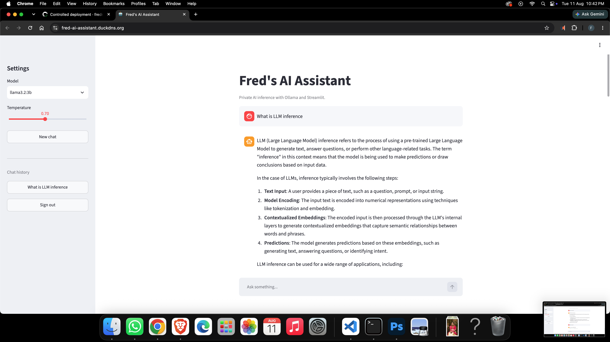
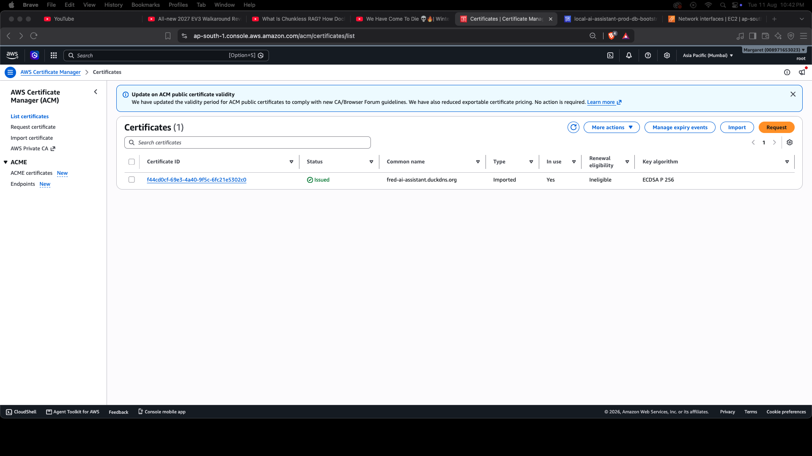
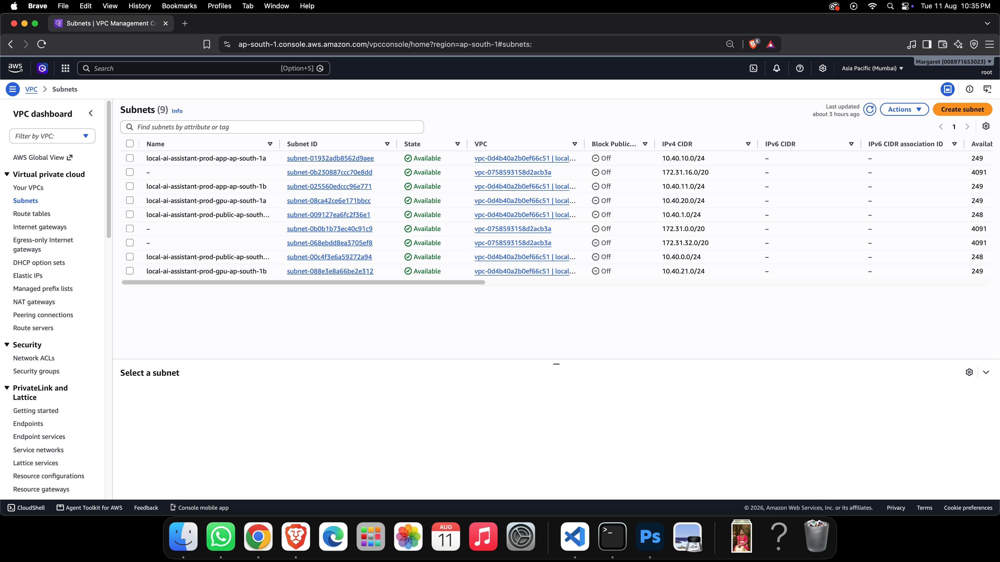
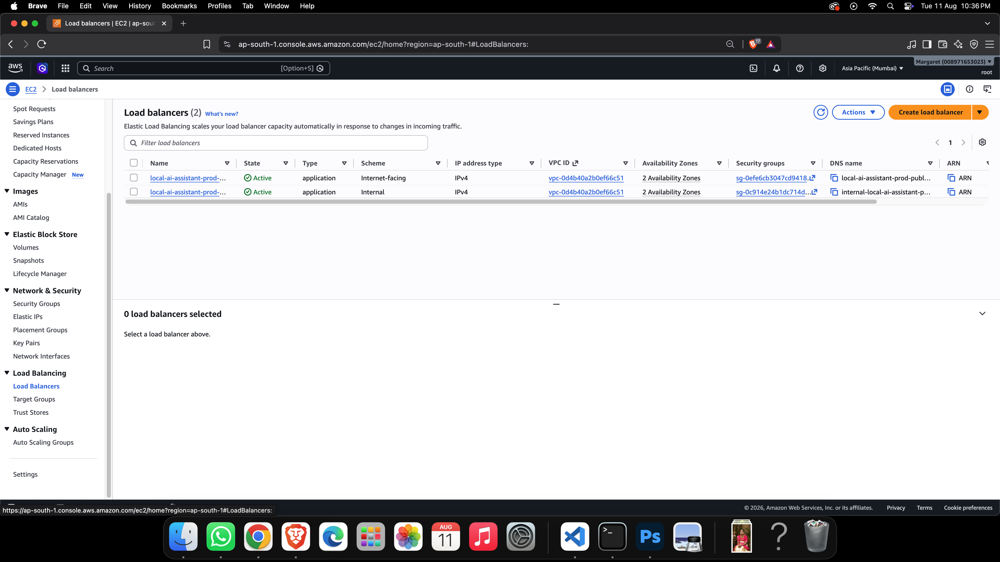
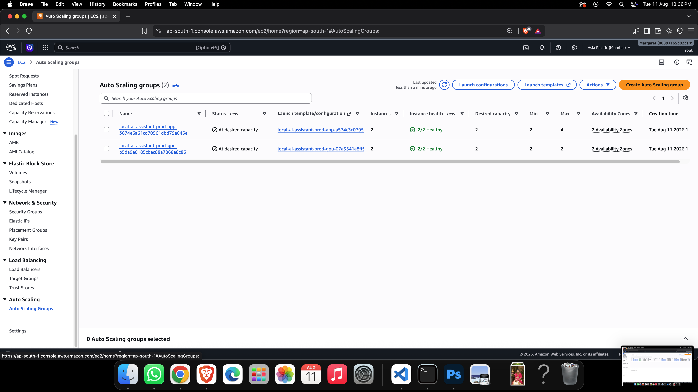
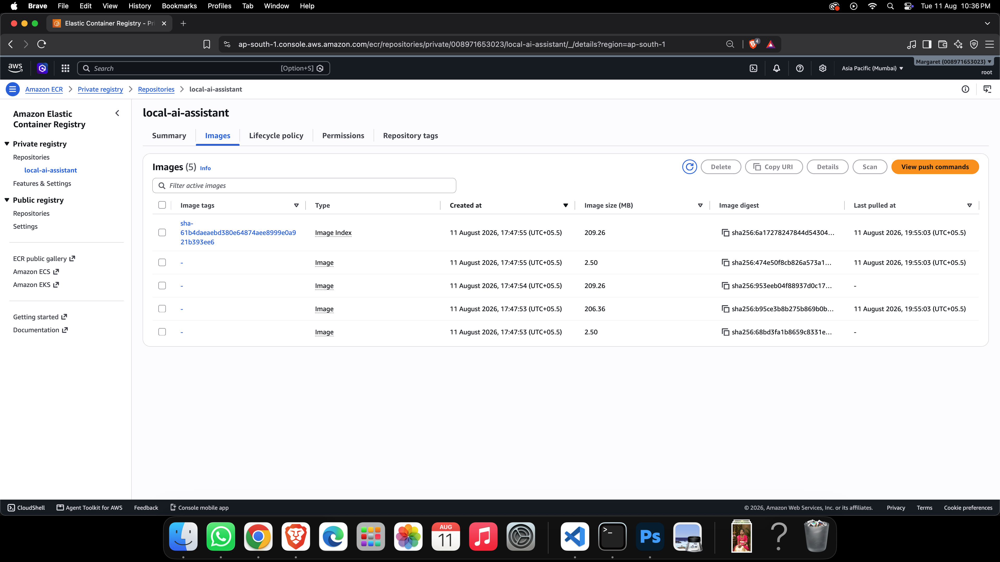
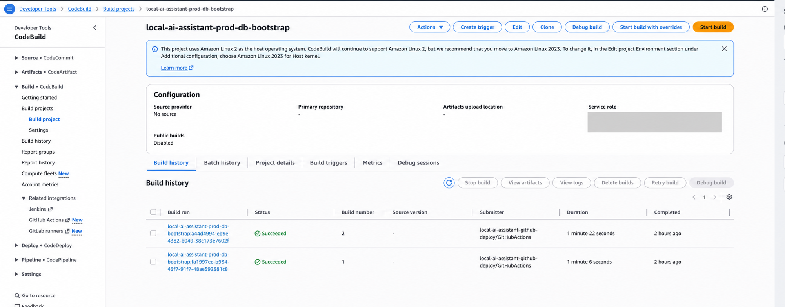
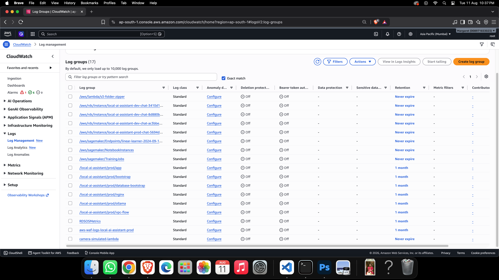
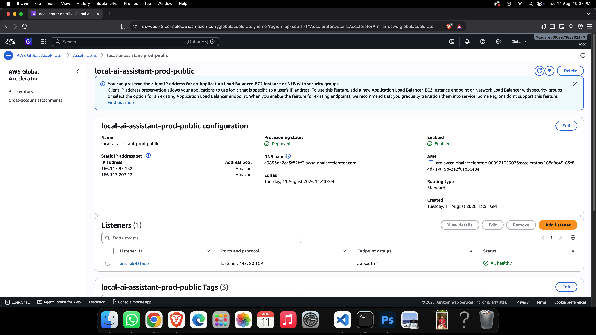

# Production deployment evidence

This record documents the production deployment performed by the
`Controlled deployment` GitHub Actions workflow. Identifiers that are not
useful for reproducing the deployment, including the AWS account ID, resource
ARNs, database endpoint, public IP addresses, and email addresses, are
intentionally omitted.

## Deployment record

| Field | Evidence |
|---|---|
| Date | August 11, 2026, 14:39:55–14:43:39 UTC (20:09:55–20:13:39 IST) |
| Git commit | [`6d608cf5049d3e066cf0f379f44951ffcb0ecc37`](https://github.com/fredritchie/local-ai-assistant-ollama/commit/6d608cf5049d3e066cf0f379f44951ffcb0ecc37) |
| CI run | [CI #83](https://github.com/fredritchie/local-ai-assistant-ollama/actions/runs/31502463188): application, infrastructure, configuration, and security jobs passed |
| Deployment run | [Controlled deployment #36](https://github.com/fredritchie/local-ai-assistant-ollama/actions/runs/31502775450): succeeded |
| ECR image digest | `sha256:6a17278247844d54304773b061840ff012a1931abeb9076f8b30853a045656a3` |
| Model | `llama3.2:3b` |
| Model digest | `sha256:a80c4f17acd55265feec403c7aef86be0c25983ab279d83f3bcd3abbcb5b8b72` |
| Region | AWS Asia Pacific (Mumbai), `ap-south-1` |
| Application capacity | 2 × `t4g.small`, one each in `ap-south-1a` and `ap-south-1b` |
| GPU capacity | 2 × `g4dn.xlarge`, one each in `ap-south-1a` and `ap-south-1b` |
| Deployment duration | 3 minutes 44 seconds for the workflow; 3 minutes 38 seconds for the deploy job |
| Terraform result | 3 resources added, 3 changed, 0 destroyed |
| Database bootstrap | Dedicated CodeBuild execution succeeded in 1 minute 22 seconds |
| Pipeline health gate | Passed at `2026-08-11T14:43:36Z` against the HTTPS `/healthz` endpoint |
| Independent smoke check | Passed at `2026-08-11T16:59:27Z`: HTTP 200 health response, TLS verification successful, and Streamlit page detected |
| Deployed integration test | [Deployed integration tests #1](https://github.com/fredritchie/local-ai-assistant-ollama/actions/runs/31515356504): smoke test and 2/2 deployed Pytest checks passed |

The independent health request completed in approximately 0.41 seconds. This
single request demonstrates reachability, not an application latency benchmark.

## Verified platform state

- The public Application Load Balancer is internet-facing.
- The Ollama Application Load Balancer is internal.
- Both load balancers span two Availability Zones.
- Both application instances and both GPU instances were healthy and in
  service when the evidence was collected.
- PostgreSQL IAM-user bootstrap completed successfully under its dedicated
  CodeBuild role.
- Production application, bootstrap, database-bootstrap, Nginx, Ollama, VPC
  flow, RDS, and WAF log groups were present in CloudWatch.
- The public certificate was valid for `fred-ai-assistant.duckdns.org` when
  checked on August 11, 2026, with expiry on November 9, 2026.
- An authenticated user completed an Ollama-backed conversation using
  `llama3.2:3b`, with chat history visible in the application sidebar.
- The separately dispatched deployed integration workflow completed in 39
  seconds. It verified the health endpoint and application page; both tests
  passed in 1.91 seconds.

## Visual evidence

### Production application and model response

The authenticated Streamlit application successfully served an Ollama-backed
response using `llama3.2:3b`.



The follow-up question demonstrates conversation context within the active
session and records a four-second response time.



These application screenshots show a browser certificate warning. A later
independent OpenSSL and `curl` verification succeeded for the same hostname,
but the screenshots are retained as historical evidence rather than presented
as proof of browser TLS validity.

### Multi-AZ network and service topology

Dedicated public, application, and GPU subnets are present across
`ap-south-1a` and `ap-south-1b`.



The public application load balancer is internet-facing while the Ollama load
balancer is internal; both span two Availability Zones.



Both Auto Scaling Groups are at desired capacity. The application group and
GPU group each report two out of two healthy instances.



### Immutable delivery and database bootstrap

The ECR repository contains the deployed multi-architecture image index and
its immutable digest.



The dedicated PostgreSQL bootstrap project completed successfully. Its AWS
service-role ARN is redacted in the committed evidence image.



### Observability and stable entry point

Production application, bootstrap, database-bootstrap, Nginx, Ollama, VPC flow,
RDS, and WAF log groups are present with the configured production retention.



Global Accelerator is deployed and enabled, with healthy listeners forwarding
ports 80 and 443 to the Mumbai endpoint group.



## Known limitations

- The deployed integration workflow currently verifies reachability and the
  Streamlit page only. It does not submit an authenticated chat request or
  verify persistence across an application-instance replacement.
- The displayed four-second response is one interactive observation, not a
  repeatable latency or throughput benchmark.
- No controlled instance-failure or recovery exercise is included in this
  evidence record yet.
- Streamlit UI session state is process-local, although users and chat history
  are persisted in PostgreSQL.
- GPU instances are continuously provisioned and dominate operating cost; the
  environment does not scale inference capacity to zero.
- The DuckDNS setup publishes one Global Accelerator address. Full DNS-level
  address redundancy requires a DNS provider that supports multiple A records.

## Reproduction commands

```bash
gh run view 31502775450
gh run view 31502463188

curl --fail --silent --show-error \
  https://fred-ai-assistant.duckdns.org/healthz

./scripts/smoke_test.sh https://fred-ai-assistant.duckdns.org
```

Re-run the deployed integration test locally when needed:

```bash
INTEGRATION_BASE_URL=https://fred-ai-assistant.duckdns.org \
  pytest -v -m integration
```
